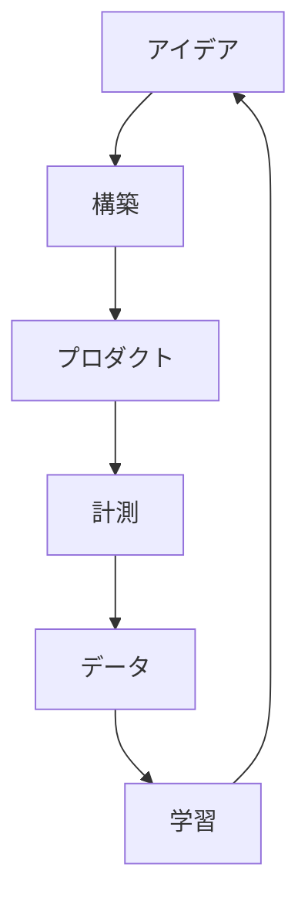

<!-- START doctoc generated TOC please keep comment here to allow auto update -->
<!-- DON'T EDIT THIS SECTION, INSTEAD RE-RUN doctoc TO UPDATE -->

- [アナリティクスの必要性](#%E3%82%A2%E3%83%8A%E3%83%AA%E3%83%86%E3%82%A3%E3%82%AF%E3%82%B9%E3%81%AE%E5%BF%85%E8%A6%81%E6%80%A7)
- [スタートアップとは](#%E3%82%B9%E3%82%BF%E3%83%BC%E3%83%88%E3%82%A2%E3%83%83%E3%83%97%E3%81%A8%E3%81%AF)
- [リーンスタートアップ](#%E3%83%AA%E3%83%BC%E3%83%B3%E3%82%B9%E3%82%BF%E3%83%BC%E3%83%88%E3%82%A2%E3%83%83%E3%83%97)
  - [中心的なコンセプト](#%E4%B8%AD%E5%BF%83%E7%9A%84%E3%81%AA%E3%82%B3%E3%83%B3%E3%82%BB%E3%83%97%E3%83%88)

<!-- END doctoc generated TOC please keep comment here to allow auto update -->

# アナリティクスの必要性

売れるものを作るために、皆が欲しいものを調べる手法。

# スタートアップとは

スケーラブルで再現性のある利益を生み出すビジネスモデルを探索する一時的な組織。

# リーンスタートアップ

顧客開発+アジャイルソフトウェア開発手法+リーン生産方式  
製品とビジネスを素早く効率的に開発するフレームワーク

## 中心的なコンセプト

「構築->計測->学習」のプロセス。

