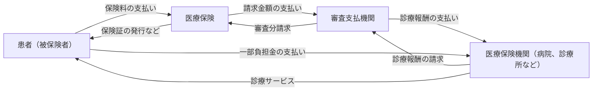

<!-- START doctoc generated TOC please keep comment here to allow auto update -->
<!-- DON'T EDIT THIS SECTION, INSTEAD RE-RUN doctoc TO UPDATE -->

- [社会保険](#%E7%A4%BE%E4%BC%9A%E4%BF%9D%E9%99%BA)
  - [社会保障と社会保険](#%E7%A4%BE%E4%BC%9A%E4%BF%9D%E9%9A%9C%E3%81%A8%E7%A4%BE%E4%BC%9A%E4%BF%9D%E9%99%BA)
  - [公費負担医療制度](#%E5%85%AC%E8%B2%BB%E8%B2%A0%E6%8B%85%E5%8C%BB%E7%99%82%E5%88%B6%E5%BA%A6)
  - [日本は国民皆保険・国民皆年金が達成されている](#%E6%97%A5%E6%9C%AC%E3%81%AF%E5%9B%BD%E6%B0%91%E7%9A%86%E4%BF%9D%E9%99%BA%E3%83%BB%E5%9B%BD%E6%B0%91%E7%9A%86%E5%B9%B4%E9%87%91%E3%81%8C%E9%81%94%E6%88%90%E3%81%95%E3%82%8C%E3%81%A6%E3%81%84%E3%82%8B)
  - [保険料と給付](#%E4%BF%9D%E9%99%BA%E6%96%99%E3%81%A8%E7%B5%A6%E4%BB%98)
  - [給付が保険料を上回っている](#%E7%B5%A6%E4%BB%98%E3%81%8C%E4%BF%9D%E9%99%BA%E6%96%99%E3%82%92%E4%B8%8A%E5%9B%9E%E3%81%A3%E3%81%A6%E3%81%84%E3%82%8B)
  - [国民総所得の3/1が医療・福祉・年金に使われている](#%E5%9B%BD%E6%B0%91%E7%B7%8F%E6%89%80%E5%BE%97%E3%81%AE31%E3%81%8C%E5%8C%BB%E7%99%82%E3%83%BB%E7%A6%8F%E7%A5%89%E3%83%BB%E5%B9%B4%E9%87%91%E3%81%AB%E4%BD%BF%E3%82%8F%E3%82%8C%E3%81%A6%E3%81%84%E3%82%8B)
- [ヘルスケア](#%E3%83%98%E3%83%AB%E3%82%B9%E3%82%B1%E3%82%A2)
  - [医療](#%E5%8C%BB%E7%99%82)
  - [福祉](#%E7%A6%8F%E7%A5%89)
    - [措置制度](#%E6%8E%AA%E7%BD%AE%E5%88%B6%E5%BA%A6)
    - [介護保険制度](#%E4%BB%8B%E8%AD%B7%E4%BF%9D%E9%99%BA%E5%88%B6%E5%BA%A6)
  - [保険](#%E4%BF%9D%E9%99%BA)
- [医療保険](#%E5%8C%BB%E7%99%82%E4%BF%9D%E9%99%BA)
  - [職業によって異なる保険](#%E8%81%B7%E6%A5%AD%E3%81%AB%E3%82%88%E3%81%A3%E3%81%A6%E7%95%B0%E3%81%AA%E3%82%8B%E4%BF%9D%E9%99%BA)
  - [保険者](#%E4%BF%9D%E9%99%BA%E8%80%85)
  - [高額療養費制度](#%E9%AB%98%E9%A1%8D%E7%99%82%E9%A4%8A%E8%B2%BB%E5%88%B6%E5%BA%A6)
  - [審査支払機関](#%E5%AF%A9%E6%9F%BB%E6%94%AF%E6%89%95%E6%A9%9F%E9%96%A2)
    - [請求内のチェック = 審査](#%E8%AB%8B%E6%B1%82%E5%86%85%E3%81%AE%E3%83%81%E3%82%A7%E3%83%83%E3%82%AF--%E5%AF%A9%E6%9F%BB)
- [保険診療](#%E4%BF%9D%E9%99%BA%E8%A8%BA%E7%99%82)
  - [保険診療と自由診療の組み合わせ](#%E4%BF%9D%E9%99%BA%E8%A8%BA%E7%99%82%E3%81%A8%E8%87%AA%E7%94%B1%E8%A8%BA%E7%99%82%E3%81%AE%E7%B5%84%E3%81%BF%E5%90%88%E3%82%8F%E3%81%9B)
  - [医療保険が使える医療](#%E5%8C%BB%E7%99%82%E4%BF%9D%E9%99%BA%E3%81%8C%E4%BD%BF%E3%81%88%E3%82%8B%E5%8C%BB%E7%99%82)
  - [保険外併用療養費制度](#%E4%BF%9D%E9%99%BA%E5%A4%96%E4%BD%B5%E7%94%A8%E7%99%82%E9%A4%8A%E8%B2%BB%E5%88%B6%E5%BA%A6)
  - [医療保険は病気や怪我に対して](#%E5%8C%BB%E7%99%82%E4%BF%9D%E9%99%BA%E3%81%AF%E7%97%85%E6%B0%97%E3%82%84%E6%80%AA%E6%88%91%E3%81%AB%E5%AF%BE%E3%81%97%E3%81%A6)
  - [中央社会保険医療協議会](#%E4%B8%AD%E5%A4%AE%E7%A4%BE%E4%BC%9A%E4%BF%9D%E9%99%BA%E5%8C%BB%E7%99%82%E5%8D%94%E8%AD%B0%E4%BC%9A)
- [介護保険](#%E4%BB%8B%E8%AD%B7%E4%BF%9D%E9%99%BA)
  - [介護報酬](#%E4%BB%8B%E8%AD%B7%E5%A0%B1%E9%85%AC)
  - [介護保険の特徴](#%E4%BB%8B%E8%AD%B7%E4%BF%9D%E9%99%BA%E3%81%AE%E7%89%B9%E5%BE%B4)
- [人生100年時代](#%E4%BA%BA%E7%94%9F100%E5%B9%B4%E6%99%82%E4%BB%A3)
- [全世代型社会保障](#%E5%85%A8%E4%B8%96%E4%BB%A3%E5%9E%8B%E7%A4%BE%E4%BC%9A%E4%BF%9D%E9%9A%9C)
  - [ICTの活用](#ict%E3%81%AE%E6%B4%BB%E7%94%A8)
  - [オンライン診療科](#%E3%82%AA%E3%83%B3%E3%83%A9%E3%82%A4%E3%83%B3%E8%A8%BA%E7%99%82%E7%A7%91)
- [包括払い](#%E5%8C%85%E6%8B%AC%E6%89%95%E3%81%84)
  - [出来高払い](#%E5%87%BA%E6%9D%A5%E9%AB%98%E6%89%95%E3%81%84)
  - [包括払い方式](#%E5%8C%85%E6%8B%AC%E6%89%95%E3%81%84%E6%96%B9%E5%BC%8F)

<!-- END doctoc generated TOC please keep comment here to allow auto update -->

# 社会保険

以下3つを指す

- 医療保険
  - 病気や怪我に備える
    - 健康保険
- 介護保険
  - 介護が必要になったときに備える
- 年金保険
  - 高齢などで働けなくなったときの収入の減少に備える
    - 厚生年金
    - 国民年金

## 社会保障と社会保険

社会保証制度の中に社会保険が含まれている。

- 社会保険
  - 目的を定めてお金を出し合う仕組み
    - 医療のため
    - 介護のため
- 社会保障
  - 目的を定めずにみんなのために出し合ったお金

## 公費負担医療制度

社会保険料を抑えることが困難であったり、一定程度の国の責任があるときに税金で賄うもの。
対象は

- 社会福祉
  - 社会福祉
  - 児童福祉
  - etc...
- 公的扶助
  - 生活保護制度
- 保健医療・公衆衛生
  - 医療サービス
  - 保健事業
  - 母子保健
  - 公衆衛生
  - etc...

## 日本は国民皆保険・国民皆年金が達成されている

20歳以上の国民がなんらかの医療保険・年金保険に加入している。

## 保険料と給付

社会保険において、出し合うお金を保険料、使われるお金を給付という。

## 給付が保険料を上回っている

高齢化に伴う医療費の増加によって、給付が保険料を上回っている。
保険料を引き上げようにも、保険料を出せない人が増ている現状限界がある。
そのため消費税を筆頭に税金で賄われている。

## 国民総所得の3/1が医療・福祉・年金に使われている

国民所得に対して社会保障給付費は3/1に達している。

# ヘルスケア

- 医療
- 福祉
- 保険

をほとまとめにしてヘルスケアと呼ぶ

## 医療

- 診療
  - 医師が行う
- 歯科診療
  - 歯科医師が行う
- 看護
  - 看護師が行う
- 調剤や薬剤管理
  - 薬剤師が行う
- 助産
  - 助産師が行う

などを総称して医療という。

## 福祉

- 障害者サービス
- 生活保護
- 介護保険に含まれない介護

### 措置制度

「行政がサービスの利用先や内訳を決め、援護が必要な人に公費で介護サービスを提供する」
福祉は措置制度というしくみのもとで行われてきた。

### 介護保険制度

介護の大部分が社会保険となった。
しかし、福祉の中には介護行為が含まれるため、介護は福祉の一部と考えることもある。

## 保険

- 健康診断
- 疾病ごとの検診
- 健康指導

など。
「健康を守り保つこと」なので、医療の前に位置する。

# 医療保険

## 職業によって異なる保険

- 被用者保険
  - サラリーマン
    - 健康保険組合
    - 協会けんぽ
    - etc...
- 国民健康保険
  - 自営業者
- 長寿医療制度
  - 高齢者

## 保険者

医療保険を運営する組織のこと

- 健康保険組合
- 協会けんぽ
- 共済組合
- 市町村国民健康保険
- 後期高齢者医療広域連合

## 高額療養費制度

だいたい月4~25万円を上限（年齢や収入で変動）として、それ以上は医療保険から支払われる。

## 審査支払機関

膨大な数の医療機関と保険者間がやり取りすると煩雑なために設けられている窓口。

- 被用者保険
  - 社会保険診療報酬支払基金（支払基金）
- 国民健康保険
  - 国民健康保険団体連合会（国保連）

### 請求内のチェック = 審査

複雑な診療報酬のため、「診療報酬点数表」に基づいて請求内容をチェックする。
しかし、さまざまな被保険者の診療に対して柔軟な対応が求められるケースがある。そのときに

- 支払基金と国保連間
- 都道府県ごと

で対応の差が発生してしまっている。ここを解消するべく動きはある。

# 保険診療

保険診療以外にも自由診療（保険外診療）が存在している

## 保険診療と自由診療の組み合わせ

保険診療と自由診療の組み合わせる「混合診療」が原則不可能。
両方受けた場合にはすべて自費診療になる。（例外として保険外併用療養費制度）

## 医療保険が使える医療

- 特別な部分にはお金を使わない
  - 病室のアップグレード
  - 美容整形
- 効果がはっきりしているものに使う
- 使える範囲などが法令で決められている
  - 健康保険法などで適用範囲が決められている
    - 医療保険制度が使われにくくなる可能性の排除のため

## 保険外併用療養費制度

混合診療の不自由性の解消のため、限定的に保険診療と自由診療を併用することができる制度。

- 一定の効果が認められた先進医療
- 差額ベット代

いつくか種類がある

- 評価療養
  - 先進医療など
  - 将来的な保険導入を前提に評価
- 選定療養
  - 特別な療養に対して
    - 差額ベッド
    - 予約診療
  - 個々の医療記述や項目について法令で認める旨が決められている
- 患者申出療養
  - 2016年から
  - 一定の条件を満たせば保険診療との併用が可能
    - 例）日本では認められていないが、外国で開発されている医療を使いたい場合、医師の助言をもとに国に対して申請し、国の専門機関で安全性や有効性が一定程度認められれば使える

##　医療機関によるサービス提供

保険診療時には、保険者ではなくて医療機関がサービス提供を行う。

- 現物給付
  - 医療行為を提供すること
- 療養の給付
  - 現物給与による医療のこと
- 現金給与
  - 民間の生命保険など、お金を後で支払うこと
  - 保険診療はこれに該当しない

## 医療保険は病気や怪我に対して

療養の給付は、「疾病または負傷に関して」と健康保険法で定められている。
よって予防注射や美容整形は保険診療の対象外となる。

## 中央社会保険医療協議会

健康保険法の条文からは、どの医療や薬に保険適用がされるかは明確にはわからない。
そのため、中央社会保険医療協議会が規定する「診療報酬点数表」がある。

# 介護保険

2000年から始まった制度。
病気でないのに入院する「社会的入院」が増えた原因に、「福祉サービス」を依頼することがあった。福祉サービスには種類。数に限界があり、家族による介護にも原因がある。
これを解消するために保険の適用を政府が考えた。

## 介護報酬

利用者は1~2割を自己負担、残りが保険者から介護サービス提供者に支払われる。

## 介護保険の特徴

- 加入は40歳以上
  - 若者が介護が必要な場面は限られているが、保険料を負担させるのは好ましくないため
- 介護サービスを受けるには認定が必要
  - 「要介護認定」「要支援認定」を受ける必要がある
    - 要介護状態
      - 寝たきりや認知症で日常的に介護が必要
    - 要支援状態
      - 日常生活に支障がある
  - 要介護度、要支援度によって、使えるサービスの種類や量が決まっている
    - 要介護者 = 介護給付
    - 要支援者 = 予防給付
      - 介護保険制度改革によって、給付の一部が介護保険給付から市区町村の「地域支援事業」に移行
      - より地域の特性にあった介護予防サービスを提供できるため
- 給付に上限あり
  - 「区分支給限度基準額」という上限額を超えると、全額自己負担
- ケアマネージャーがサービス内容を計画
  - サービス提供者とは違う「ケアマネージャー（介護支援専門員）」がサービス内容の計画を立てる（ケアプラン）
    - 居宅サービス計画
    - 介護予防サービス計画
- 保険者は市区町村
  - 介護保険料や給付対象サービスが少しずつ異なる

# 人生100年時代

2025年には団塊の世代が後期高齢者になる。
2040年には団塊ジュニア世代が65歳以上の高齢者になる。

# 全世代型社会保障

2040年にむけた改革。人生100年時代を見据えて、これまでの高齢者中心の社会保障から全世代を対象とした社会保障に変えること。
例えば

- 後期高齢者の窓口負担は1割から2割負担。
- 短時間勤務制度
- 勤労者皆保険

## ICTの活用

2022年度の診療報酬改定で、ICTの活用に関する改定が行われた。
医療DXが加速する。電子カルテをはじめとする医療データの共通利用や管理などが議論。

## オンライン診療科

2018年度の改定で新設された。
コロナによりニーズが高まった。

# 包括払い

## 出来高払い

基本診療料の上に特掲診療料が加算される。1つ1つの医療行為の報酬を積み重ねることを「出来高払い方式」という

- メリット
  - 点数として評価されることによる質の高い医療が可能
- デメリット
  - 不要な医療行為を行うことがある

## 包括払い方式

「一般的にこういった検査を行い、この手術を行い、投薬はこの程度」という医療費設定を標準的な姿で設定しておく。
DRG/PPSという制度。Diagnosis Related Group/Prospective Payment System。
追加の診療行為による加算はされない。
